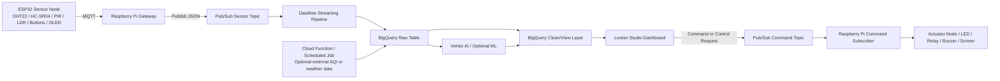

# Google Cloud Tutorial for IoT Workshop and Dashboard

## 1. Tutorial Goal

This tutorial is for a workshop where each student team uses ESP32 devices and one Raspberry Pi to build a cloud-connected IoT system on Google Cloud.

The tutorial covers:
- Google Cloud architecture for the workshop
- Step-by-step setup of Google Cloud services
- Data flow from ESP32 sensor node to dashboard
- Command flow from dashboard back to Raspberry Pi and actuator node
- Space for you to manually insert screenshots later

---

## 2. Target Workshop Architecture

### 2.1 System Concept

The workshop uses this end-to-end flow:

1. **ESP32 Sensor Node** reads sensors and publishes data by MQTT.
2. **Raspberry Pi** acts as the local bridge or gateway.
3. **Google Cloud Pub/Sub** receives streaming messages.
4. **Dataflow** moves and transforms streaming data.
5. **BigQuery** stores historical IoT data.
6. **Looker Studio** shows dashboards and trends.
7. **Dashboard command input** sends control messages.
8. **Raspberry Pi** subscribes to cloud commands and controls LED, buzzer, relay, fan, pump, or display.

### 2.2 Recommended Google Cloud Architecture



### 2.3 Why This Architecture Fits a Workshop

- **Pub/Sub** is suitable for event-driven IoT ingestion.
- **Dataflow** is suitable for streaming data from Pub/Sub into BigQuery.
- **BigQuery** is suitable for time-series style analytics, aggregation, and dashboard queries.
- **Looker Studio** is easy for students to build dashboards without writing a full web frontend.
- **Raspberry Pi** is useful as a bridge for MQTT, local control, and cloud command handling.

> Reference basis: Google Cloud documents describe Pub/Sub as an asynchronous messaging service, Dataflow as a managed data processing service, Dataflow templates for Pub/Sub to BigQuery streaming, and Looker Studio integration with BigQuery. 

---

## 3. Workshop Resource Design

To avoid teams interfering with each other, each team should use separate cloud resource names.

### 3.1 Naming Convention

Use a team prefix such as:
- `team01`
- `team02`
- `team03`

Example resource names:
- Pub/Sub topic: `team01-sensor-topic`
- Pub/Sub topic: `team01-command-topic`
- Pub/Sub subscription: `team01-sensor-sub`
- Pub/Sub subscription: `team01-command-sub`
- BigQuery dataset: `team01_iot`
- BigQuery table: `sensor_raw`
- BigQuery table: `sensor_clean`

### 3.2 Suggested Shared Project Model

Use one shared Google Cloud project for the whole class, but each team creates:
- its own Pub/Sub topics and subscriptions
- its own BigQuery dataset
- its own dashboard or report copy
- its own service account key only if strictly necessary

---

## 4. Prerequisites

Before starting, prepare the following:

- Google Cloud project already created by instructor
- Student IAM accounts added into the shared project
- Billing enabled on the project if required by the selected services
- Raspberry Pi connected to internet
- ESP32 boards ready to send MQTT messages
- Chrome browser for Google Cloud Console and Looker Studio

### Screenshot Placeholder

**[Insert Screenshot Here: Shared project overview / IAM members page]**

---

## 5. Google Cloud Services Used in This Workshop

Main services:
- **Pub/Sub** for message ingestion and control messages
- **Dataflow** for streaming pipeline from Pub/Sub to BigQuery
- **BigQuery** for data storage and SQL analysis
- **Looker Studio** for dashboard and visualization

Optional services:
- **Cloud Functions** for scheduled ingestion from public APIs such as air quality or weather
- **Vertex AI** for prediction or simple ML inference
- **Cloud Storage** for exporting files or storing static assets if needed

---

## 6. Step 1: Open the Shared Google Cloud Project

1. Sign in to Google Cloud Console.
2. Select the workshop project provided by the instructor.
3. Confirm that you are inside the correct project before creating any resources.

Checklist:
- Project name is correct
- Project ID is correct
- You can open Pub/Sub, BigQuery, and Dataflow pages

### Screenshot Placeholder

**[Insert Screenshot Here: Google Cloud Console project selector]**

---

## 7. Step 2: Enable Required APIs

Enable these APIs in the shared project:
- Pub/Sub API
- BigQuery API
- Dataflow API
- Cloud Functions API (optional)
- Cloud Build API (optional, often needed by Functions)
- Artifact Registry API (optional, depending on deployment path)
- Vertex AI API (optional)

### Console Steps

1. In Google Cloud Console, go to **APIs & Services**.
2. Click **Enable APIs and Services**.
3. Search and enable each required API.

### Suggested API List

- Cloud Pub/Sub API
- BigQuery API
- Dataflow API
- Cloud Functions API
- Cloud Build API
- Artifact Registry API
- Vertex AI API

### Screenshot Placeholder

**[Insert Screenshot Here: Enabled APIs page]**

---

## 8. Step 3: Create Pub/Sub Topics and Subscriptions

This workshop uses two main message directions:
- **Sensor uplink**: device data to cloud
- **Command downlink**: cloud command to device

### 8.1 Create Sensor Topic

Create a topic such as:
- `team01-sensor-topic`

### 8.2 Create Command Topic

Create another topic such as:
- `team01-command-topic`

### 8.3 Create Subscriptions

Create subscriptions:
- `team01-sensor-sub` for the sensor topic
- `team01-command-sub` for the command topic

### Why both topic and subscription?

- A **topic** receives published messages.
- A **subscription** lets a consumer read those messages.

### Console Steps

1. Go to **Pub/Sub**.
2. Click **Create topic**.
3. Enter `team01-sensor-topic`.
4. Create the topic.
5. Repeat for `team01-command-topic`.
6. Open each topic and create a subscription.

### Recommended Settings

- Delivery type: Pull
- Retention: default is acceptable for workshop
- Message ordering: off unless you need ordered commands

### Screenshot Placeholder

**[Insert Screenshot Here: Pub/Sub topics list]**

**[Insert Screenshot Here: Pub/Sub subscription creation form]**

---

## 9. Step 4: Design the JSON Message Format

Define a consistent JSON payload from ESP32 or Raspberry Pi.

### Example Sensor Payload

```json
{
  "team_id": "team01",
  "device_id": "esp32_sensor_01",
  "ts": "2026-03-25T10:15:00Z",
  "temperature_c": 29.4,
  "humidity_pct": 72.1,
  "distance_cm": 18.5,
  "pir": 1,
  "ldr": 840,
  "pot": 1350,
  "button_a": 0,
  "button_b": 1,
  "status": "normal"
}
```

### Example Command Payload

```json
{
  "team_id": "team01",
  "target": "rpi_actuator_01",
  "ts": "2026-03-25T10:20:00Z",
  "command": "set_led",
  "value": "green",
  "source": "dashboard"
}
```

### Design Rules

- Keep field names short but clear.
- Always include timestamp.
- Always include team ID and device ID.
- Keep the same schema for all messages in the same stream.

### Screenshot Placeholder

**[Insert Screenshot Here: Your architecture slide or JSON message example screenshot]**

---

## 10. Step 5: Create BigQuery Dataset and Tables

### 10.1 Create Dataset

Create a dataset for each team, for example:
- Dataset ID: `team01_iot`

### 10.2 Create Raw Table

Create a raw table for incoming sensor data:
- Table name: `sensor_raw`

You can define schema manually or let the pipeline map JSON to fields.

### Suggested Schema for `sensor_raw`

| Field | Type |
|---|---|
| team_id | STRING |
| device_id | STRING |
| ts | TIMESTAMP |
| temperature_c | FLOAT |
| humidity_pct | FLOAT |
| distance_cm | FLOAT |
| pir | INTEGER |
| ldr | INTEGER |
| pot | INTEGER |
| button_a | INTEGER |
| button_b | INTEGER |
| status | STRING |
| ingest_time | TIMESTAMP |

### Console Steps

1. Go to **BigQuery**.
2. Create dataset `team01_iot`.
3. Create table `sensor_raw`.
4. Add schema fields manually.

### Recommended Dataset Settings

- Region: choose the same region used by Pub/Sub/Dataflow resources when possible
- Table type: native table

### Screenshot Placeholder

**[Insert Screenshot Here: BigQuery dataset creation]**

**[Insert Screenshot Here: BigQuery table schema editor]**

---

## 11. Step 6: Create Dataflow Streaming Pipeline

The easiest workshop path is to use the **Pub/Sub to BigQuery** streaming template.

### What This Pipeline Does

- Reads JSON messages from Pub/Sub subscription
- Optionally transforms fields
- Writes rows into BigQuery table

### Console Steps

1. Open **Dataflow**.
2. Click **Create job from template**.
3. Select the template for **Pub/Sub Subscription to BigQuery**.
4. Enter a job name such as `team01-pubsub-to-bq`.
5. Select region.
6. Enter input Pub/Sub subscription: `team01-sensor-sub`.
7. Enter output BigQuery table: `project_id:team01_iot.sensor_raw`.
8. Configure temporary location if requested.
9. Start the job.

### Notes

- Some template variants expect JSON messages and schema-compatible field names.
- If field transformation becomes complex, switch later to a custom Dataflow or Beam pipeline.

### Screenshot Placeholder

**[Insert Screenshot Here: Dataflow template selection page]**

**[Insert Screenshot Here: Dataflow job parameter form]**

---

## 12. Step 7: Publish Test Messages to Pub/Sub

Before connecting the real ESP32, publish a sample JSON message from the Google Cloud Console.

### Console Steps

1. Open the topic `team01-sensor-topic`.
2. Click **Publish message**.
3. Paste a sample JSON payload.
4. Publish.
5. Wait for Dataflow to process it.
6. Check whether the row appears in BigQuery.

### Sample Test Payload

```json
{
  "team_id": "team01",
  "device_id": "esp32_sensor_01",
  "ts": "2026-03-25T10:15:00Z",
  "temperature_c": 29.4,
  "humidity_pct": 72.1,
  "distance_cm": 18.5,
  "pir": 1,
  "ldr": 840,
  "pot": 1350,
  "button_a": 0,
  "button_b": 1,
  "status": "normal",
  "ingest_time": "2026-03-25T10:15:05Z"
}
```

### Verify in BigQuery

Run a simple query:

```sql
SELECT *
FROM `YOUR_PROJECT_ID.team01_iot.sensor_raw`
ORDER BY ts DESC
LIMIT 20;
```

### Screenshot Placeholder

**[Insert Screenshot Here: Publish message dialog in Pub/Sub]**

**[Insert Screenshot Here: BigQuery query result showing test rows]**

---

## 13. Step 8: Create a Cleaned View for Dashboard Use

Instead of connecting the dashboard directly to the raw table, create a view for cleaner fields.

### Example View

```sql
CREATE OR REPLACE VIEW `YOUR_PROJECT_ID.team01_iot.sensor_clean` AS
SELECT
  team_id,
  device_id,
  ts,
  temperature_c,
  humidity_pct,
  distance_cm,
  pir,
  ldr,
  pot,
  button_a,
  button_b,
  status,
  DATETIME(ts, "Asia/Bangkok") AS ts_bangkok,
  EXTRACT(HOUR FROM DATETIME(ts, "Asia/Bangkok")) AS hour_local,
  DATE(DATETIME(ts, "Asia/Bangkok")) AS date_local
FROM `YOUR_PROJECT_ID.team01_iot.sensor_raw`;
```

### Why Create a View?

- simpler dashboard field names
- reusable local time conversion
- easier filtering and aggregation
- avoids editing raw ingestion table

### Screenshot Placeholder

**[Insert Screenshot Here: BigQuery SQL editor with view creation]**

---

## 14. Step 9: Create Looker Studio Dashboard

Looker Studio can connect directly to BigQuery.

### 14.1 Create Data Source

1. Open Looker Studio.
2. Create a new **Data Source**.
3. Select the **BigQuery** connector.
4. Choose your billing project if required.
5. Select your project, dataset, and view/table.
6. Add the data source.

### 14.2 Create Report Pages

Suggested dashboard pages:

#### Page A: Live Sensor Overview
- latest temperature
- latest humidity
- latest distance
- PIR status
- LDR value
- current button status

#### Page B: Time-Series Trends
- temperature over time
- humidity over time
- distance over time
- light level over time

#### Page C: Device Health / Activity
- message count by hour
- latest device timestamp
- last seen status by device

### Suggested Charts

- Scorecard for latest value
- Time series chart
- Table of latest records
- Filter control for device_id
- Date range control

### Screenshot Placeholder

**[Insert Screenshot Here: Looker Studio BigQuery connector setup]**

**[Insert Screenshot Here: First dashboard page layout]**

---

## 15. Step 10: Add a Command Path from Dashboard to Device

Looker Studio is mainly for analytics and dashboards. It is not a full SCADA HMI by itself. For workshop control, use one of these approaches:

### Option A: Manual Cloud Command Publisher

Students manually publish a command message into Pub/Sub from Google Cloud Console.

This is the easiest for teaching command flow.

Example command:

```json
{
  "team_id": "team01",
  "target": "rpi_actuator_01",
  "ts": "2026-03-25T10:20:00Z",
  "command": "set_buzzer",
  "value": "on",
  "source": "console"
}
```

### Option B: Simple Web App or Cloud Function API

Build a lightweight command page that sends HTTP requests to a Cloud Function or Cloud Run service, which then publishes to the command topic.

This is closer to a real dashboard control path.

### Recommended for Workshop

Start with **Option A** first, then extend later to **Option B**.

### Screenshot Placeholder

**[Insert Screenshot Here: Pub/Sub command topic publish screen]**

---

## 16. Step 11: Raspberry Pi Command Subscriber

The Raspberry Pi subscribes to the command subscription and performs local control.

### Example Control Flow

1. Dashboard user or instructor publishes command to `team01-command-topic`
2. Raspberry Pi reads message from `team01-command-sub`
3. Raspberry Pi parses JSON
4. Raspberry Pi triggers LED, relay, buzzer, or sends local MQTT message to ESP32 actuator node

### Suggested Roles of Raspberry Pi

- bridge between Google Cloud and local MQTT
- subscriber for command topic
- local device controller
- optional local display controller

### Screenshot Placeholder

**[Insert Screenshot Here: Raspberry Pi subscriber program running]**

---

## 17. Step 12: Optional External Data Ingestion with Cloud Function

This is useful when the workshop also wants public air quality or weather data.

### Example Use Case

- Cloud Function runs on a schedule
- Fetches public AQI or weather data
- Writes data into BigQuery
- Dashboard compares local sensor values with public environmental data

### High-Level Steps

1. Create a function.
2. Add code to call external API.
3. Parse JSON response.
4. Insert rows into BigQuery.
5. Schedule execution with Cloud Scheduler if needed.

### Screenshot Placeholder

**[Insert Screenshot Here: Cloud Function creation page]**

---

## 18. Step 13: Optional Machine Learning with Vertex AI

After the basic pipeline works, you can extend to prediction.

### Example ML Ideas

- predict room occupancy from PIR + light + time
- classify environment as normal/warning/alert
- predict actuator state from sensor trends

### Recommended ML Flow

1. Export training data from BigQuery.
2. Train model in Vertex AI or notebook environment.
3. Store predictions back into BigQuery.
4. Show predictions in Looker Studio.

### Screenshot Placeholder

**[Insert Screenshot Here: Vertex AI workbench or training page]**

---

## 19. End-to-End Validation Checklist

Use this checklist after setup.

### Cloud Resource Check

- [ ] Pub/Sub sensor topic exists
- [ ] Pub/Sub command topic exists
- [ ] Sensor subscription exists
- [ ] Command subscription exists
- [ ] BigQuery dataset exists
- [ ] BigQuery raw table exists
- [ ] Dataflow streaming job is running
- [ ] Looker Studio dashboard connects successfully

### Data Flow Check

- [ ] Test message can be published to sensor topic
- [ ] Dataflow receives the message
- [ ] BigQuery table shows the row
- [ ] Dashboard shows new data

### Command Flow Check

- [ ] Command message can be published
- [ ] Raspberry Pi receives the command
- [ ] Local actuator responds correctly

---

## 20. Troubleshooting Guide

### Problem: No data appears in BigQuery

Check:
- Dataflow job is running
- Pub/Sub subscription name is correct
- JSON field names match table schema
- Timestamp format is valid

### Problem: Dashboard cannot see data

Check:
- BigQuery table or view contains rows
- Looker Studio is connected to the correct project/dataset/view
- Date filter is not excluding the data

### Problem: Raspberry Pi does not receive commands

Check:
- command topic and subscription names are correct
- subscriber program is running
- IAM permissions are sufficient
- team ID and target field match the local device logic

### Problem: Students overwrite each other’s resources

Check:
- each team uses its own naming prefix
- dashboards point to the correct dataset
- no shared topic names are reused by mistake

---

## 21. Recommended Minimal Workshop Path

For the first successful workshop run, keep the system minimal:

### Phase 1: Core Data Pipeline
- ESP32 or Raspberry Pi publishes JSON
- Pub/Sub receives sensor data
- Dataflow writes to BigQuery
- Looker Studio shows dashboard

### Phase 2: Command Return Path
- Publish command manually from console
- Raspberry Pi subscribes and controls actuator

### Phase 3: Advanced Features
- external AQI/weather API
- ML prediction with Vertex AI
- custom control web app

---

## 22. Suggested Lab Structure

### Lab A: Cloud Setup
- enable APIs
- create topics and subscriptions
- create BigQuery dataset and table

### Lab B: Streaming Data
- create Dataflow job
- publish test messages
- verify rows in BigQuery

### Lab C: Dashboard
- connect Looker Studio to BigQuery
- build sensor charts and scorecards

### Lab D: Command Control
- publish command messages
- Raspberry Pi reads commands and controls output

### Lab E: Extension
- add external data or ML prediction

---

## 23. Notes for Instructor

- Prepare one shared project in advance.
- Enable all APIs before class if possible.
- Pre-create a sample team dataset and table as reference.
- Prepare one working JSON message example.
- Prepare one sample Looker Studio dashboard and let students duplicate it.
- Prepare one Raspberry Pi subscriber script in advance.

---

## 24. Reference Notes for This Tutorial

This tutorial is aligned with current Google Cloud documentation describing:
- Pub/Sub as a scalable asynchronous messaging service
- Dataflow as a managed data processing service
- the Pub/Sub-to-BigQuery streaming template
- Looker Studio integration with BigQuery
- Google Cloud architecture guidance for connected devices / IoT platforms

When finalizing your workshop handout, you may optionally add direct links to:
- Pub/Sub overview
- Dataflow documentation
- Pub/Sub to BigQuery template tutorial
- BigQuery + Looker Studio integration
- Google Cloud IoT architecture guidance

---

## 25. Screenshot Insertion Index

You can later replace each placeholder with real screenshots.

1. Shared project overview / IAM members page
2. Google Cloud project selector
3. Enabled APIs page
4. Pub/Sub topics list
5. Pub/Sub subscription creation form
6. JSON message example or architecture slide
7. BigQuery dataset creation
8. BigQuery table schema editor
9. Dataflow template selection page
10. Dataflow job parameter form
11. Pub/Sub publish message dialog
12. BigQuery query result showing test rows
13. BigQuery SQL editor for view creation
14. Looker Studio BigQuery connector setup
15. First dashboard page layout
16. Pub/Sub command topic publish screen
17. Raspberry Pi subscriber program running
18. Cloud Function creation page
19. Vertex AI page

